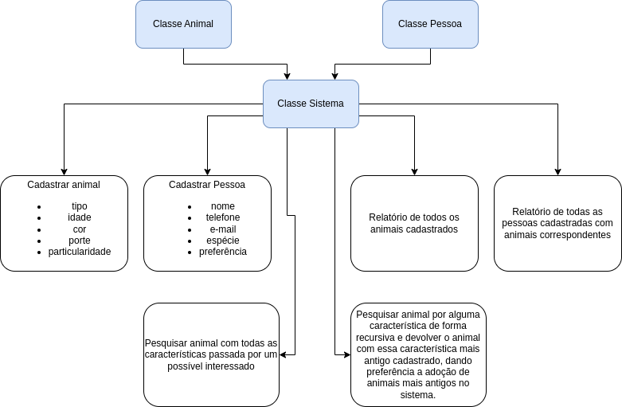
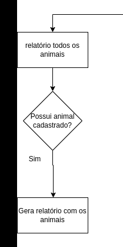
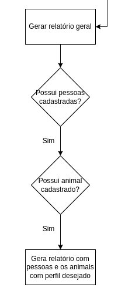
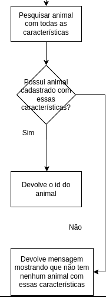
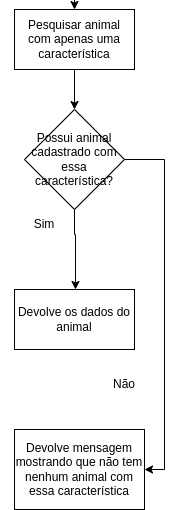

# Universidade de Vassouras


[](https://universidadedevassouras.edu.br/campus-marica/)
# Conheca o Curso de Engenharia de Software 
[](https://universidadedevassouras.edu.br/graduacao-marica/engenharia-de-software/)

## Equipe
Composta pelo aluno do 3º Periodo, turma B, que é:

* Fernando Fraga

# Disciplina e Professor
Estrutura de dados, matéria ministrada pelo professor [Marcio Garrido](https://github.com/marciogarridoLaCop)

## Problema

A prefeitura precisa de um sistema que possa cadastrar todos os animais por tipo (canino, felino, etc.) e para tanto, é uma premissa que seja possível inserir novos tipos dinamicamente. Precisa ainda, que sejam classificados por idade aproximada, cor, porte e se possui alguma particularidade. No mesmo sistema, deverá ter também um cadastro de pessoas interessadas na adoção, contendo os dados principais de contato e qual espécie teria o interesse de adotar. Ao escolher a espécie, deve também informar se possui alguma preferência do animal. Por fim, no final do mês a prefeitura emitirá um relatório de cruzamento de espécies disponíveis x possíveis candidatos, ou quando um candidato a adoção ligar, que o atendente possa pesquisar se há algum animal com as características informadas.




## Explicação do código
Abaixo temos alguns pontos principais do código e sua explicação:

### Passo 1


```python
def relatorio_todos_animais(self):
    for animal in self.animais:
    print(f'id: {animal.id}')
    print(f'tipo: {animal.tipo}')
    print(f'idade: {animal.idade}')
    print(f'cor: {animal.cor}')
    print(f'porte: {animal.porte}')
    print('----------------------------')
 ```
 Na parte descrita pelo código acima, temos a criação do relatório com todos os animais cadastrados no sistema.

 ### Passo 2
 

 ```python
              
def gerar_relatorio(self):
    for pessoa in self.pessoas:
        print(f'Relatório Nº {self.id}')
        print(f'Candidato: {pessoa.nome}')
        print(f'Espécie de interesse: {pessoa.especie}')
        print(f'Particulariedade desejada: {pessoa.preferencia}')
        print('Animais correspondentes:')
        for animal in self.animais:
            if animal.tipo == pessoa.especie:
                print(f'-Id animal: {animal.id} ,Tipo: {animal.tipo}, Idade: {animal.idade}, Cor: {animal.cor}, Porte: {animal.porte}, Particularidade: {animal.particularidade}')
                idade = 0
                cor = 0
                porte = 0
                if animal.porte == pessoa.preferencia:
                    porte = 1 * 0.8
                if animal.idade == pessoa.preferencia:
                    idade = 1 * 0.6
                if animal.cor == pessoa.preferencia:
                    cor = 1 * 0.4
                pessoa.pontuacao = porte + idade + cor
                print(f'A pontuação do usuário para o animal de id {animal.id} é: {pessoa.pontuacao}')
        print('--------------------
 ```
Nesse passo temos a criação do relatório geral, devolvendo as pessoas cadastras e os animais que se aderem ao perfil requerido pelo interessado.

### Passo 3
 

```python
def pesquisar_animal(self, tipo, idade, cor, porte, particularidade):
        
    for animal in self.animais:
        if animal.tipo == tipo and animal.idade == idade and animal.cor == cor and animal.porte == porte and animal.particularidade == particularidade:
            print(f'O animal pesquisado é o animal de Id {animal.id}')
    return 'Nenhum animal encontrado com tais características'

```
Nesse método temos uma pesquisa por características específicas do interessado. Se alguma característica requerida não for atendida, devolverá uma mensagem demonstrando não estar disponível um animal com aquelas características

### Passo 4
 

```python
def pesquisar_animal_pesquisa_binaria_recursiva(self, item, inicio=0, fim=None):
    lista_id = []
    lista_porte = []
    
    for animal in sistema.animais:
        lista_porte.append(animal.porte)
        lista_id.append(animal.id)
    
    lista_merge = [(lista_id[i], lista_porte[i]) for i in range(0, len(lista_id))]
        
    if fim is None:
        fim = len(lista_porte)-1
    if inicio <= fim:
        metade = (inicio + fim) // 2
        if lista_merge[metade][1] == item:
            print(f'O id do animal procurado é: {lista_merge[metade][0]}') # achou
            #for animal in self.animais:
            #    lista_id.append(animal.id)
            for animal in sistema.animais:
                if animal.id == lista_merge[metade][0]:
                    print(f'-Id animal: {animal.id} ,Tipo: {animal.tipo}, \
Idade: {animal.idade}, Cor: {animal.cor}, Porte: {animal.porte}, Particularidade: {animal.particularidade}')
                    print('---------------------------------------')
        elif item < lista_porte[metade]: # procura a esquerda
            return pesquisar_animal_pesquisa_binaria_recursiva(self, item, inicio, metade-1)
        else: # procura a direita
            return pesquisar_animal_pesquisa_binaria_recursiva(self, item, metade+1, fim)
    return 'Não há animais com essa característica'
```
Nesse métodos, temos um método recursivo para achar animais com apenas uma característica específica, usando o método de busca binária. Aqui procuramos acha o animal mais antigo do sistema que tenha a característica requerida.

